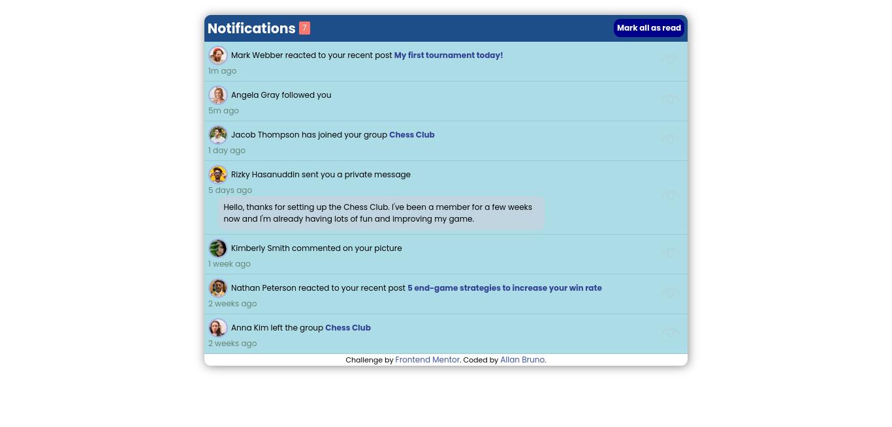
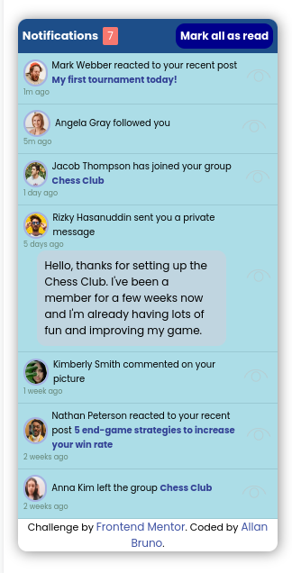

<h1 align="center">Notifications Page</h1>

Desktop Preview

Mobile Preview

<h1 align="center">⬇️ What is it? ⬇️</h1>

## This web page have the intention of simulate the behavior of a notification page, challenge in FrontendMentor

<small>OBS: None of these codes must be put in practice on a real project, they're not perfect and can always be upgraded, if so, please make a pull request.</small>

---

<h1 align="center">⬇️ Tehnologies used ⬇️</h1>

- HTML
- CSS
- JavaScript Vanilla

---

<h1 align="center">⬇️ License ⬇️</h1>

This project is under license. Click [here](/LICENSE) for details.
